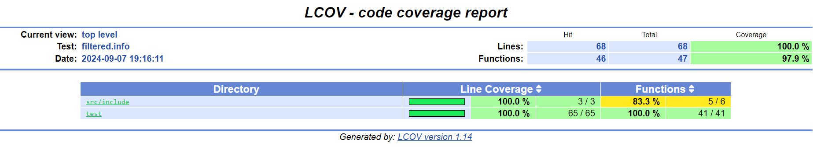

# OOP Lab 1

Данный проект содержит библиотеку, предназначенную для работы с сериализацией и десериализацией
В частности, представлена реализация для работы с обьектом класса `Car`

```c++
class Car {
    std::string brand;
    std::string owner;
    double mileage;
}
```

Реализовать набор функций для преобразования структуры автомобиля в строку формата `toml` и обратно.
Структура автомобиля состоит из следующих полей:

* марка (`brand`, строка длиной до 16 символов, которая может включать в себя только буквы, дефис
  и пробелы);
* ФИО владельца (`owner`, строка произвольной длины);
* пробег (`mileage`, дробное число, соответствующее величине пробега в тыс. км).
  На вход функции передаётся экземпляр структуры и название записи. Функция преобразования в строку
  должна вернуть строку в формате `toml`.
  Функция преобразования из строки должна получать на вход строковое представление экземпляра и
  возвращать исходный экземпляр структуры. Экранирование символов допускается не реализовывать.
  Например, запись `{brand="BMW", owner="PYA", mileage=10.3}` при названии «`car`» необходимо
  преобразовать в строку (пробельные символы, кроме заключённых в кавычки, служат исключительно для
  форматирования и могут быть опущены):

```toml
[car]
brand = "BMW"
owner = "PYA"
mileage = 10.3
```

Реализовать 3 перегрузки описанных функций:

1. Работает с нуль-терминированной строкой `(const char *)`.
2. Работает с массивом символов и их количеством `(const char * + size_t)`.
3. Работает с экземпляром класса `std::string`



## License

```
MIT License

Copyright (c) 2024 Konstantin Albatov

Permission is hereby granted, free of charge, to any person obtaining a copy
of this software and associated documentation files (the "Software"), to deal
in the Software without restriction, including without limitation the rights
to use, copy, modify, merge, publish, distribute, sublicense, and/or sell
copies of the Software, and to permit persons to whom the Software is
furnished to do so, subject to the following conditions:

The above copyright notice and this permission notice shall be included in all
copies or substantial portions of the Software.

THE SOFTWARE IS PROVIDED "AS IS", WITHOUT WARRANTY OF ANY KIND, EXPRESS OR
IMPLIED, INCLUDING BUT NOT LIMITED TO THE WARRANTIES OF MERCHANTABILITY,
FITNESS FOR A PARTICULAR PURPOSE AND NONINFRINGEMENT. IN NO EVENT SHALL THE
AUTHORS OR COPYRIGHT HOLDERS BE LIABLE FOR ANY CLAIM, DAMAGES OR OTHER
LIABILITY, WHETHER IN AN ACTION OF CONTRACT, TORT OR OTHERWISE, ARISING FROM,
OUT OF OR IN CONNECTION WITH THE SOFTWARE OR THE USE OR OTHER DEALINGS IN THE
SOFTWARE.
```
